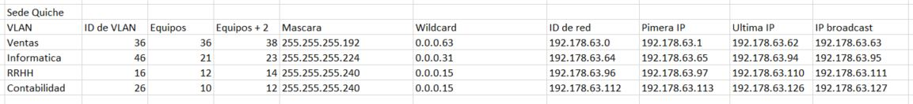
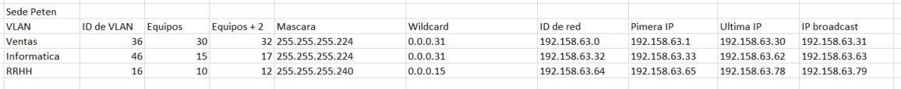
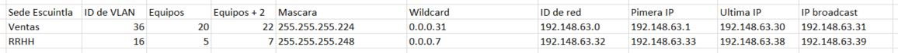
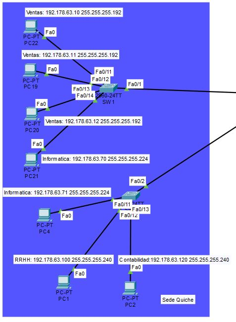
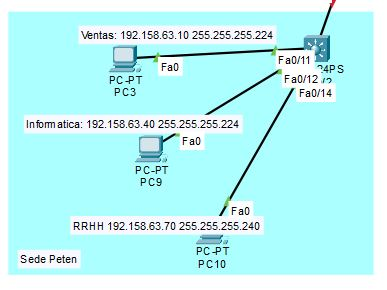
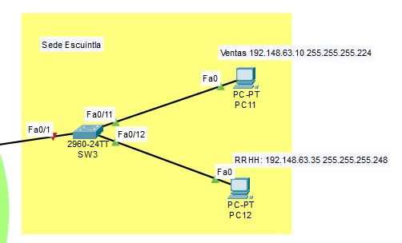
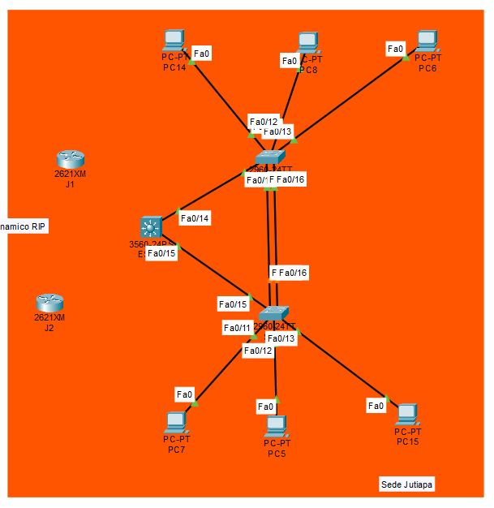
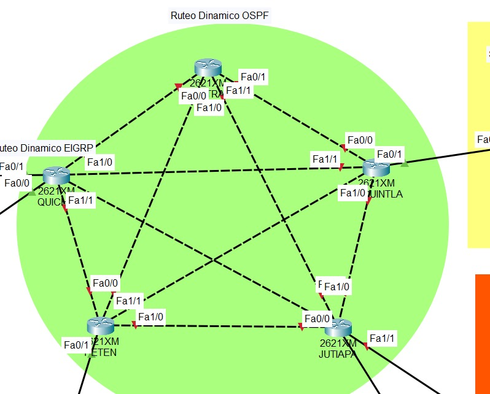

# Cesar Daniel Martínez Mencos 201904016
# David Eduardo Lopez Morales 201907483

## Manual tecnico

### Direcciones IP:

### Sede Quiche:

PC Ventas 1:
Direccion IPV4: 192.178.63.10 
PC Ventas 2:
Direccion IPV4: 192.178.63.11
PC Ventas 3:
Direccion IPV4: 192.178.63.12

PC Informatica 1:
Direccion IPV4: 192.178.63.70
PC Informatica 2:
Direccion IPV4: 192.178.63.71

PC RRHH 1:
Direccion IPV4: 192.178.63.100

PC Contabilidad 1:
Direccion IPV4: 192.178.63.120

### Sede Peten:

PC Ventas 1:
Direccion IPV4: 192.158.63.10 

PC Informatica 1:
Direccion IPV4: 192.158.63.40

PC RRHH 1:
Direccion IPV4: 192.158.63.70

### Sede Escuintla:

PC Ventas 1:
Direccion IPV4: 192.148.63.10 

PC RRHH 1:
Direccion IPV4: 192.148.63.35

### VLANS:

RRHH:
16

Contabilidad:
26

Ventas:
36

Informatica:
46

### VLSM:

Sede Quiche:

Sede Peten:

Sede Escuintla:

### Capturas de la implementacion de las topologias:

Sede Quiche:

Sede Peten:

Sede Escuintla:

Sede Jutiapa:

Central:

### Detalle de los comandos utilizados:

Se asignaron vlan manualmente a los switches y se activo el modo troncal:
vlan 10
name contabilidad
exit
int f0/11
switchport mode access
switchport access vlan 10
exit
int f0/12
switchport mode access
switchport access vlan 20
exit
int f0/1
switchport mode trunk

Se uso router on a stick:
int f0/0
no shutdown
exit
int f0/0
interface fa0/0.10
encapsulation dot1Q 10
ip address 192.168.63.1 255.255.255.0
no shutdown
interface fa0/0.20
encapsulation dot1Q
ip address 192.168.63.1 255.255.255.0
no shutdown
exit
do wr

Para el enrutamiento EIGRP se uso:
int fa0/0
ip address 192.168.63.1 255.255.255.0
no shut
int fa0/1
ip address 192.168.63.1 255.255.255.252
no shut
router eigrp 10
network 192.168.63.0 0.0.0.255
network 192.168.63.0 0.0.0.3
no auto-summary

Para el enrutamiento OSPF se uso:
int fa0/1
ip address 192.168.63.1 255.255.255.0
no shut
int fa0/0
ip address 192.168.63.1 255.255.255.252
no shut
router ospf 10
network 192.168.63.0 0.0.0.255 area 0
network 192.168.63.0 0.0.0.3 area 0

Para el enrutamiento RIP se uso:
interface fa0/1
ip address 192.168.63.1 255.255.255.0
no shutdown
interface fa0/0
ip address 192.168.63.1 255.255.255.0
no shutdown
router rip
version 2
network 192.168.63.0
network 192.168.63.0